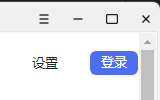
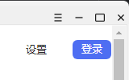

## QSS通用属性

## 控件类的 QSS
### QPushButton
#### 设置图标
```css
icon:url(":/images/button.svg");
```
或者
```css
qproperty-icon: url (:/img/folder.png);
```

暂未测试两者区别。第一种从Qt5.15开始支持

> [QPushButton](https://doc.qt.io/qt-5/qpushbutton.html)
>
> [QPushButton icon](https://doc.qt.io/qt-5/stylesheet-reference.html#icon-prop)

### QTabBar
#### QTabBar::close-button
可以设置 tab 关闭按钮的位置
```css
QTabBar::close-button {
    subcontrol-position: left;
}
```
比如改为 left 后，关闭按钮将在左侧显示：

#### QTabBar::tear
QSS 中 `QTabBar::tear` 子控件用于设置 QTabBar 的可分离指示器。
当 tab 个数大于一定个数时，出现右侧的左右箭头并点击右箭头时，会出现如下图左侧波浪线形状的线条，这是 Qt 自带的，作用是点击回到第一个 tab

例如：
```css
QTabBar::tear {
    width: 10px;
    background-color: yellowgreen;
}
```
就变成了宽度为 10 px，背景颜色为绿黄色的样式。

也可将其去掉：
```css
QTabBar::tear {
    width: 0px; 
    border: none;
}
```


### QTabBar QToolButton::left-arrow
当在 `QTabBar QToolButton::left-arrow` 中设置 `background-color: transparent` 或者 ` border:none ` 无效时，通过 `QTabBar QToolButton[accessibleName="Scroll Left"]` 可以解决此问题。
```css
/*** 左箭头 ***/
QTabBar QToolButton::left-arrow {  
    background-color: #f3f3f3;  
    image: url(:/resources/images/tab-left-arrow.svg);  
}  
  
/*** 右箭头 ***/
QTabBar QToolButton::right-arrow {  
    background-color: #f3f3f3;  
    image: url(:/resources/images/tab-right-arrow.svg);  
}  
  
QTabBar QToolButton[accessibleName="Scroll Left"]{  
    border:0px;  
}  
  
QTabBar QToolButton[accessibleName="Scroll Right"]{  
    border:0px;  
}
```

## QCalendarWidget

代码方面也有一些需要注意的

```cpp
//设置一周的第一天
ui->calendarWidget->setFirstDayOfWeek(Qt::Sunday);
//设置为本地，才能使SingleLetterDayNames生效，显示为一，二形式
ui->calendarWidget->setLocale( QLocale::Chinese);//容易遇到的坑
ui->calendarWidget->setHorizontalHeaderFormat(QCalendarWidget::SingleLetterDayNames);
ui->calendarWidget->setVerticalHeaderFormat(QCalendarWidget::NoVerticalHeader);

//默认第一列和最后一列为红色，需要设置format改为黑色，QSS貌似不能实现。
QTextCharFormat format;
format.setForeground(QColor("#333333"));
ui->calendarWidget->setWeekdayTextFormat(Qt::Sunday, format);
ui->calendarWidget->setWeekdayTextFormat(Qt::Saturday, format);
```


```css
/*整体widget*/
QCalendarWidget QWidget { 
background-color:#FFFFFF;
 }

QCalendarWidget QToolButton {
    height: 60px;
    width: 150px;
    color: #333333;
    font-size: 24px;
    icon-size: 20px, 20px;
    background-color: #FFFFFF;
}

/*前后月按钮图标*/
QToolButton#qt_calendar_prevmonth,#qt_calendar_nextmonth{
	border:1px solid;
}
/*月份选择*/
QCalendarWidget QMenu {
    width: 150px;
    left: 20px;
    color: #333333;
    font-size: 18px;
    background-color: #FFFFFF;
}
QCalendarWidget QMenu::item:selected{
	color:red;
}
  
/* header row */
QCalendarWidget QWidget { 
alternate-background-color:#FFFFFF; 
}
  
/* normal days */
QCalendarWidget QAbstractItemView:enabled
{
    color: #333333; 
    background-color: #FFFFFF; 
    selection-background-color:#FFFFFF;
    selection-color: #3377FF;
	outline:1px solid #3377FF;
}
```

> https://doc.qt.io/qt-5/qcalendarwidget.html#setHeaderTextFormat
>
> https://www.cnblogs.com/yinsedeyinse/p/11597516.html
>
> https://qtdebug.com/qtbook-qss-calendar/

## QScrollBar
```css
/* 整个垂直滚动条区域样式 */
QScrollBar:vertical, QScrollBar:horizontal {  
    border: none;  
    background: transparent;  
    margin: 0px;  
    width: 8px;  
    border-radius: 4px;  
}  
  
QScrollBar:vertical:hover, QScrollBar:horizontal:hover {  
    background: rgba(0, 0, 0, 0.05);  
}  
  
/* 滑块样式 */
QScrollBar::handle:vertical, QScrollBar::handle:horizontal {  
    background: rgb(210, 210, 210);  
    min-height: 20px;  
    width: 8px;  
    border-radius: 4px;  
    margin: 0px;  
}  
  
QScrollBar::handle:vertical:hover, QScrollBar::handle:horizontal:hover {  
    background: rgb(190, 190, 190);  
}  
  
/* 隐藏上下的箭头按钮 */
QScrollBar::add-line:vertical, QScrollBar::sub-line:vertical, QScrollBar::add-line:horizontal, QScrollBar::sub-line:horizontal {  
    border: none;  
    background: none;  
}  
  
/* 滑块 和add-line/sub-line 之间的区域 */
QScrollBar::add-page:vertical, QScrollBar::sub-page:vertical, QScrollBar::add-page:horizontal, QScrollBar::sub-page:horizontal {  
    border: none;  
    background: none;  
}
```

需要注意，圆角的设置可能会因宽度或高度不够，导致圆角无法显示。建议小于等于宽度或高度的一半。

QScrollBar 示例图：

## 实用属性

### 样式表的轮廓线属性
outline：绘制在对象边框上的轮廓

场景：一些控件有虚线框时需要去掉，或者需要加选中为边框时。

```css
font-size: 11pt;
padding: 2px 12px 2px 12px;
color: #FFFFFF;
border: 1px solid #3377FF;
background-color: qlineargradient(x1:0, y1:0, x2:0, y2:1, stop:0 #80AEFF, stop:1 #3377FF);
border-radius: 2px;
height:40px;
width: 200px;
outline:2px solid red;/*如图红色边框*/
```


如图，默认会有虚线框。


去掉可使用
```css
outline:none;
```

换为实线框可使用
```css
outline:1px solid #3377FF;
```
效果如图：


去掉获得焦点时的虚线框（待测试）：
```css
QWidget:focus {  
    outline: none; /* 去掉得到焦点时的虚线框 */  
}
```

### 批量修改控件样式
有时，需要指定一批控件设置为单独样式，可以采用以下方式：

```css
/* custom_label_ 开头的标签样式 */
QLabel[objectName^="custom_label_"] {
    font-size: 20pt;
}
```
使用属性选择器 `[objectName^="custom_label_"]` 匹配所有 `objectName` 以 "custom_label_" 开头的 QLabel

## 注意的点
### 无边框按钮问题
按钮可通过 `setFlat(true)` 或者 qss 的 `border:none` 或 `background-color: transparent;` 实现，但三者是有区别的。
从现象上看，`setFlat(true)` 和 `background-color: transparent;` 是一致的
而 `border:none` 则是有区别的

| setFlat(true)                                     | background-color: transparent                     | border:none                                       |
| ------------------------------------------------- | ------------------------------------------------- | ------------------------------------------------- |
| .png) |  |  |


从现象看，`border:none`设置后，图标会靠下边。其他场景未了解是否一致。
> 实测在 Linux 系统上（Ubuntu、UOS）使用 `background-color: transparent` 方式会有差异，透明背景会变黑。

### 自定义 Widget 的背景问题
如果从 QWidget 派生子类，则需要为自定义 QWidget 提供 paintEvent ，用于支持 background, background-clip, background-origin 的 QSS 属性

```cpp
void CustomWidget::paintEvent(QPaintEvent *)
{
    QStyleOption opt;
    opt.initFrom(this); // old version: opt.init(this);
    QPainter p(this);
    style()->drawPrimitive(QStyle::PE_Widget, &opt, &p, this);
}
```


> [Customizing Qt Widgets Using Style Sheets](https://doc.qt.io/qt-5/stylesheet-customizing.html)
> [Qt Style Sheets Examples](https://doc.qt.io/qt-5/stylesheet-examples.html)
> [Qt Style Sheets Reference](https://doc.qt.io/qt-5/stylesheet-reference.html)
> [超详细的QSS样式表入门Demo 原创 - mahuifa - 博客园](https://www.cnblogs.com/IntelligencePointer/p/18443758)