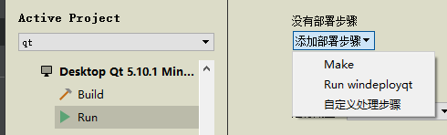
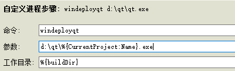

# 信号与槽
信号与槽用于两个对象之间的通信。
一个信号可以关联到多个槽上，多个信号也可以关联到同一个槽上，甚至一个信号还可以关联到另一个信号上。

声明一个信号要使用`signals`关键字，因为信号默认是public，所以在signals前面不能用public、private和protected等限定符。

声明一个槽函数要使用slots关键字，一个槽可以是public、private或protected类型，也可以被声明为虚函数。
## 信号与槽的关联
### Qt4传统方式
```cpp
[static] QMetaObject::Connection QObject::connect(
const QObject* sender,
const char* signal,
const QObject* receiver,
const char* method,
Qt::ConnectionType type = Qt::AutoConnection)
```
第一个参数为发射信号的对象，第二个参数为要发射的信号，第三个是接收信号的对象，第四个是要执行的槽函数，最后一个参数表明关联的方式，默认是Qt::AutoConnection。
```
QObject::connect(sender, SIGNAL(signal()), receiver, SLOT(slots(
)));
```
对于信号与槽，必须使用SIGNAL()和SLOT()宏，可以将参数转换为const char*。而且，头文件也需要声明SIGNAL()和SLOT()宏，且对应信号，槽函数放在对应宏范围里。
注意：调用connect()函数是，信号和槽的参数只能有类型，不能有变量名，如`SLOT(showValue(int value))`的错误的。

缺点：没有编译器检查，无法使用相容类型的参数。

Qt::ConnectionType枚举类型

|常量|描述|
| --- | --- |
| Qt::AutoConnection | 自动关联,默认值。如果信号的发出和接收信号的对象同属一个线程，则使用`Qt::DirectConnection`;否则,使用`Qt::QueuedConnection`。在信号被发射时决定使用哪种关联类型 |
| Qt::DirectConnection | 直接关联（同步）。发射完信号后立即调用槽函数,只有槽执行完成返回后,`emit`发射信号处后面的代码才可以执行。**无论槽函数所属对象在哪个线程，槽函数都在发射信号的线程内执行。** |
| Qt::QueuedConnection | 队列关联（异步）。当接收对象所在线程的事件循环取得控制权时，才取得信号，再执行对应槽函数,无论槽函数执行与否,发射信号处后面的代码都会立即执行。**槽函数在接收者所在线程执行。** |
| Qt::BlockingQueuedConnection | 阻塞队列关联。类似Qt::QueuedConnection,不过,信号线程会一直阻塞,直到槽返回。当 receiver存在于信号线程时不能使用该类型,不然程序会死锁 |
| Qt::UniqueConnection | 唯一关联。这是一个标志,可以结合其他几种连接类型,使用按位或操作。这时两个对象间的相同的信号和槽只能有唯一的关联。使用这个标志主要为了防止重复关联 |

### Qt5新方式

   Connect()函数另一种常用的基于函数指针的重载形式如下:

```cpp
[static] QMetaObject::Connection QObject::connect( 
const QObject* sender,
PointerToMemberFunction signal,
const QObject* receiver,
PointerToMemberFunction method,
Qt::ConnectionType type = Qt::AutoConnection)
```
这是Qt5加入的重载形式，指定信号和槽不再使用SIGNAL()和SLOT()宏，并且槽函数不再必须使用slots关键字声明，可以是任意能和信号关联的成员函数。
```cpp
connect(dlg,&MyDialog::dlgReturn,this,&Widget::showValue);
```
也支持Lambda表达式

```cpp
connect(dlg,&MyDialog::dlgReturn,[=](int value){
ui->label->setText(tr("获取的值：%1").arg(value));});
```

优点：
+ 支持编译器检查
+ 支持相容参数类型的自动转换
+ 允许连接到任意函数

当信号有重载的情况时,使用Qt5的新语法可能会有一些不方便。例如, QSpinBox有两个重载的信号:

```
void valueChanged ( int i)
void valueChanged (const QString& text)
```

当进行连接时,编译器会发出一个错误。因为信号 valueChanged有重载,所以使用&QSpinBox::valueChanged语句获取信号的指针会有歧义，因有两个相同名字的信号。
解决方案可用Qt4传统连接方式，也可增加显示类型转换继续使用Qt5新方式：

```
QObject::connect(spinBox,
static_cast<void(QSpinBox::*)(int)>(&QSpinBox::valueChanged),
this,
&MainWindow:: onSpinBoxValue Changed);
```

### 自动关联方式

  信号与槽的自动关联，一般Qt上默认实现。
  自行实现：
  on_pushButton_clicked()由字符串on、部件objectName和信号名称三部分组成，中间用下划线连接。
```cpp
//widget.h
private slots:
	void on_myButton_clicked();
```
widget.cpp添加头文件#include\<QPushButton>，使用自动关联的部件的定义都要放在setupUi()函数调用之前，且必须使用setObjectName()指定objectName

```cpp
//widget.cpp
Widget::Widget(QWidget* parent):QWidget(parent),ui(new Ui::Widget)
{
	QPushButton* button = new QPushButton(this); //创建按钮
	button->setObjectName("myButton"); //指定按钮的对象名
	ui->setupUi(this); //在定义控件之后再调用这个函数
}
 
void Widget::on_myButton_clicked()
{
	....
}
```
## 断开关联

可以通过 disconnect(函数来断开信号和槽的关联,其原型如下:
```cpp
[static] bool QObject::disconnect( const QObject* sender, const char * signal, const QObject* receiver, const char* method)
```
该函数一般有下面几种用法:
1. 断开与一个对象所有信号的所有关联:
`disconnect(myobject, 0,0,0);`
等价于:
`myobject ->disconnect;`
2. 断开与一个指定信号的所有关联:
`disconnect(myObject, SIGNAL( mySignal()),0,0);`
等价于:
`myObject ->disconnect(SIGNAL(mySignal())));`
3. 断开与一个指定的 receiver的所有关联:
`disconnect(myObject, 0, myReceiver, 0);`
等价于:
`myObect->disconnect(myReceiver);`
4. 断开一个指定信号和槽的关联:
`disconnect( myObject, SIGNAL( mySignal()), myReceiver, SLOT(mySlot()));`
等价于:
`myObject ->disconnect(SIGNAL(mySignal()), myReceiver, SLOT(mySlot());`
也等价于:
`disconnect( my Connection);// myConnection是进行关联时 connect()的返回值`
与 connect()函数一样, disconnect()函数也有基于函数指针的重载形式:
```cpp
[static] bool QObject::disconnect( const QObject* sender, PointerToMemberFunction signal, const QObject* receiver, PointerToMemberFunction method)
```
其用法类似,只是其信号、槽参数需要使用函数指针`&MyObject::mySignal()`、
`&MyReceiver::mySlot()`等形式。这个函数并不能断开信号与一般函数或者 lambda表达式之间的关联。
## 自定义信号及使用
信号就是在类定义里声明的一个函数，但是这个函数无需实现，只需发射（emit）。
例如，在下面的自定义类QPerson的signals部分定义一个信号ageChanged(int）。
```cpp
class QPerson : public QObject
{
	Q_OBJECT
private:
	int m_age=10;
public：
	void incAge();
signals:
	void ageChanged(int value);
}
```
信号函数必须是无返回值的函数，可以有输入参数。信号函数无需实现，只需在某些条件下发射信号。
例如，在 incAge()函数中发射信号
```cpp
void QPerson::incAge()
{
	m_age++;
	emit ageChanged(m_age);//发射信号
}
```
在incAge()函数里，当私有变量 m_age 变化后，发射信号 ageChanged(int)，表示年龄发生了变化。
关联槽函数
```
connect(this,&QPerson::ageChanged,Receiver,[](int a){...});
```
形参也可以进行一些处理

## 信号和槽的关系

+ 槽的参数的类型需要与信号参数的类型相对应
+ 槽的参数不能多于信号的参数，因为若槽的参数更多，则多余的参数不能接收到信号传递过来的值，若在槽中使用了这些多余的无值的参数，就会产生错误。
+ 若信号的参数多于槽的参数，则多余的参数将被忽略。
+ 一个信号可以与多个槽关联，多个信号也可以与同一个槽关联，信号也可以关联到另一个信号上。
+ 若一个信号关联到多个槽时，则**发射信号时，槽函数按照关联的顺序依次执行**。
+ 若信号连接到另一个信号，则当第一个信号发射时，会立即发射第二个信号。


# 主窗口框架

+ ①菜单栏( QMenuBar)

  菜单栏包含了一个下拉菜单项的列表,这些菜单项由QACtion动作类实现。菜单栏位于主窗口的顶部,一个主窗口只能有一个菜单栏。

+ ②工具栏( QToolBar)

  工具栏一般用于显示一些常用的菜单项目,也可以插入其他窗口部件,并且是可以移动的。一个主窗口可以拥有多个工具栏。

+ ③中心部件( Central Widget)

  在主窗口的中心区域可以放入一个窗口部件作为中心部件,是应用程序的主要功能实现区域。一个主窗口只能拥有一个中心部件

+ ④Dock部件( QDockWidget)

  Dock部件常被称为停靠窗口,因为可以停靠在中心部件的四周,用来放置一些部件来实现一些功能,就像个工具箱一样。一个主窗口可
  以拥有多个Dock部件。

+ ⑤状态栏( QStatusBar)

  状态栏用于显示程序的一些状态信息,在主窗口的最底部。一个主窗口只能拥有一个状态栏。


## 状态栏

QStatusBar位于界面底部，用于显示状态信息。

状态信息可以被分为3类:
+ 临时信息,如一般的提示信息;
+ 正常信息,如显示页数和行号;
+ 永久信息,如显示版本号或者日期。

可以使用 `showMessage () ` 函数显示一个临时消息, 它会出现在状态栏的最左边。
一般用 `addwidget ()` 函数添加一个 QLabel 到状态栏上, 用于显示正常信息, 它会生成到状态栏的最左边, 可能被临时消息掩盖。

如果要显示永久信息,则要使用 addPermanentWidget()函数来添加一个如QLabel一样的可以显示信息的部件,它会生成在状态栏的最右端,不会被临时消息掩盖。

状态栏的最右端还有一个 QSizeGrip部件,用来调整窗口的大小，即右下角的小黑三角，可以使用SizeGripEnabled()函数来禁用它。

不支持拖拽控件方式，所以需用代码实现。

**获取状态栏指针，可以通过ui->xxxx获取，也可以直接在mainwindow中直接使用statusBar()获取指针，因为状态栏只会有一个。**

若MainWindow未默认生成QStatusBar，可自行new一个，并在构造函数使用`setStatusBar()`，将创建QStatusBar对象放入。

临时信息：

```cpp
//　可以设置字体颜色,其他属性应该也可以
ui->statusBar->setStyleSheet("color:green"); 　
// 显示临时消息,显示2000毫秒即2秒
ui->statusBar->showMessage(tr("欢迎使用多文档编辑器"),2000);
```
正常信息：
```cpp
QLabel *msgLabel = new QLabel;
msgLabel->setStyleSheet(" QLabel{ color: red }");
msgLabel->setText("Ready :");
// insertWidget也可以，这里直接使用statusBar()添加
statusBar()->addWidget(msgLabel);
```
永久信息：
```cpp
// 创建标签,设置标签样式并显示信息,然后将其以永久部件的形式添加到状态栏
QLabel *permanent= new QLabel(this);
// 可以设置相关控件对应的属性
permanent->setFrameStyle(QFrame:: Box | QFrame::Sunken);
// 可以设置字体颜色
permanent->setStyleSheet(" QLabel{ color: red }");
permanent->setText(R"(<a href= "www.gter.org">永久信息</a>)");
permanent->setOpenExternalLinks(true);//设置可以打开网站链接
ui->statusBar->addPermanentWidget(permanent);
```

移除控件
```cpp
 // 删除指定的控件
　ui->statusBar->removeWidget(myLabel);
```

可以插入多个控件，每个控件之间会有竖线相隔，分割不同的控件，隐藏方法：
```cpp
// 将状态栏的所有item边框宽度设置为0
statusBar()->setStyleSheet(“QStatusBar::item{border: 0px}”);
```

# 对话框QDialog
分为模态和非模态对话框

**模态对话框就是在没有关闭它之前,不能再与同一个应用程序的其他窗口进行交互**，比如新建项目时弹出的对话框。而对于非模态对话框,既可以与它交互,也可以与同一程序中的其他窗口交互,如 Microsoft word中的查找替换对话框。

要想使一个对话框成为模态对话框，则只需要调用它的exec()函数；而要使其成为非模态对话框，则可以使用new操作来创建，然后使用show()函数来显示。其实使用show()函数也可以建立模态对话框，只须在其前面使用 setModal()函数即可。例如:
```cpp
QDialog *dialog = new QDialog( this);
dialog->setModal(true);
dialog->show():
```
## 标准对话框
Qt提供了一些常用的对话框类型,它们全部继承自 Dialog类,并增加了自己的特色功能,比如获取颜色、显示特定信息等。可以在帮助索引中查看 Standard Dialogs关键字,也可以直接索引相关类的类名。

### 文件对话框
文件对话框 QFileDialog类提供了一个允许用户选择文件或文件夹的对话框

#### 选择文件
QFileDialog::getOpenFileName()
```cpp
//原型
QString QFileDialog::getOpenFileName(QWidget *parent = nullptr, const QString& caption = QString(), const QString& dir = QString(), const QString& filter = QString(), QString* selectedFilter = nullptr, QFileDialog::Options options = Options())


QString fileName = QFileDialog::getOpenFileName(this,tr("文件对话框"),"D:",tr("图片文件(*.jpg *.png);;所有文件(*.*)"));
```

参数：
+ 父对象，一般是一个窗口
+ 对话框标题
+ 访问的目录
+ 过滤器，可以设置文件的选择范围，如果需要可以选择多个类型，将文件以；；符号隔开。

注：**每组文件之间用两个分号隔开，同一组内不同后缀之间用空格隔开。**
若要选择打开多个文件，使用静态函数`QFileDialog::getOpenFileNames()`

#### 选择文件夹
QFileDialog:getExistingDirectory()
同样，若需要传递对话框
标题和初始路径，还应传递一个选项，一般用QFileDialog:ShowDirsOnly,表示对话框中只显示
目录。

```cpp
QString selectedDir = QFileDialog::getExistingDirectory(this, "Title", "Path");
```
### 消息对话框
消息对话框 QMessageBox类提供了一个模态的对话框来通知用户一些信息,或者向用户提出一个问题并且获取答案。
```cpp
//问题对话框
int ret1 = QMessageBox::question(this,tr("问题对话框"),tr("你了解Qt吗?"”), MEssagebOx::Yes, QMessageBox::No);
if(ret1 = QMessageBox::Yes) qDebug()<<tr("问题!");

// 提示对话框
int ret2 = QMessageBox::information(this,tr("提示对话框"),tr("这是Qt书籍!"), QMessageBox::Ok);
if(ret2 == QMessageBox::Ok) qDebug()<<tr("提示!");

// 警告对话框
int ret3 = QMessageBox::warning(this,tr("警告对话框"),tr("不能提前结束!"), QMessageBox::Abort);
if(ret3 == QMessageBox::Abort) qDebug()<< tr("警告");

// 错误对话框
int ret4 = QMessageBox::critical(this,tr("严重错误对话框"),tr("发现一个严重错误!现在要关闭所有文件!"), QMessageBox::YesAll);
if(ret4 == QMessageBox::YesAll) qDebug()<< tr("错误");

// 关于对话框
QMessageBox::about(this,tr("关于对话框"),tr(" 致力于t及 Qt Creator的普及工作!");	
```

### 颜色对话框
 颜色对话框类 QDialog提供了一个可以获取指定颜色的对话框部件。
```cpp
QColor color = QColorDialog::getColor(Qt::red,this,tr("颜色对话框"));
```

### 字体对话框
字体对话框 QFontDialog类提供了一个可以选择字体的对话框部件
### 输入对话框
QInputDialog类用来提供一个对话框,可以让用户输入一个单一的数值或字符串
```cpp
bool ok;
// 获取字符串
QString string = QInputDialog::getText(this,tr("输人字符串对话框"),tr("请输入用户名:"), QLineEdit::Normal,tr("admin"), &ok);
if(ok) qDebug()<<"string:"<< string;
 
// 获取整数
int value1 = QInputDialog::getInt(this,tr("输入整数对话框"),
tr("请输入-1000到1000之间的数值"),100,-1000,1000,10,&ok);
if(ok) qDebug()<<"value1:"<< value1;
 
// 获取浮点数
double value2 = QInputDialog::getDouble(this,tr("输入浮点数对话框"),tr("请输入-1000到1000之间的数值"),0.00,-1000,1000,2,&ok);
if(ok) qDebug()<<"value2:"<< value2;
QStringList items;
items<<tr("条目1")<<tr("条目2");
// 获取条目
QString item = QInputDialog::getItem(this,tr("输入条目对话框"),tr("请选择或输入一个条目"), items,0,true,&ok)
if(ok) qDebug()<<"item:"<< item;
```

### 进度对话框
```cpp
QProgressDialog dialog(tr("文件复制进度"),tr("取消"),0,50000,this);
//设置窗口标题
dialog.setWindowTitle(tr("进度对话框"));
//将对话框设置为模态
dialog.setWindowModality(Qt::WindowModal);
dialog.show();
 //演示复制进度
for(int i=0; i < 50000; i++){
        //设置进度条的当前值
        dialog.setValue(i);
        //避免界面冻结
        QCoreApplication:: processEvents();
        //按下取消按钮则中断
        if(dialog.wasCanceled()) break;
    }
    //这样才能显示100%,因为for循环中少加了一个数
    dialog.setValue(50000);
    qDebug()<<tr("复制结束!");
```
### 错误信息对话框
错误信息对话框 QErrorMessage类提供了一个显示错误信息的对话框。
### 向导对话框
向导对话框 QWizard类提供了一个设计向导界面的框架
# 事件系统


## 事件的处理
 一个事件由一个特定的 QEvent子类来表示，但是有时一个事件又包含多个事件类型，比如鼠标事件又可以分为鼠标按下、双击和移动等多种操作。
 这些事件类型都由QEvent类的枚举型 QEvent::Type来表示，其中包含了一百多种事件类型,可以在QEvent类的帮助文档中进行查看。
 虽然 QEvent的子类可以表示一个事件,但是却不能用来处理事件,那么应该怎样来处理一个事件呢? QCoreApplication类的 notify()函数的帮助文档给出了5种处理事件的方法:
+ 方法一:重新实现部件的 paintEvent()、 mousePressevent()等事件处理函数。这是最常用的一种方法,不过只能用来处理特定部件的特定事件。
+ 方法二:重新实现 notify()函数。这个函数功能强大,提供了完全的控制,可以在事件过滤器得到事件之前就获得它们。但是,它一次只能处理一个事件。
+ 方法三:向 APplication对象上安装事件过滤器。因为一个程序只有一个QApplication对象,所以这样实现的功能与使用 notify()函数是相同的,优点是可以同时处理多个事件。
+ 方法四:重新实现 event()函数。 QObject类的 event()函数可以在事件到达默认的事件处理函数之前获得该事件。
+ 方法五:在对象上安装事件过滤器。使用事件过滤器可以在一个界面类中同时处理不同子部件的不同事件。
在实际编程中,最常用的是方法一,其次是方法五。因为方法二需要继承自QApplication类;而方法三要使用一个全局的事件过滤器,这将减缓事件的传递,所以,虽然这两种方法功能很强大,但是却很少被用到。
 ## 事件的传递
可以看到，事件的传递顺序是这样的：先是事件过滤器,然后是焦点部件的event()函数，最后是焦点部件的事件处理函数；如果焦点部件忽略了该事件，那么会执行父部件的事件处理函数，如图6-3所示。注意，event()函数和事件处理函数是在焦点部件内重新定义的，而事件过滤器却是在焦点部件的父部件中定义的。


## 事件的接受和忽略
事件可以被接受或忽略，被接受的事件不会再传递给其他对象，被忽略的事件会被传递给其他对象处理，或者该事件被丢弃(即没有对象处理该事件)

使用 QEvent::accept()函数表示接受一个事件，即调用 accept()，则事件不会传递给父对象，使用 QEvent::ignore()函数表示忽略一个事件，即调用 ignore()则事件会向父对象传递。

Qt 默认值是 accept ()，但在 QWidget 的默认事件处理函数(比如 keyPressEvent())中，默认值是ignore()，因为这样可实现事件的传递(即子对象未处理就传递给父对象处理)。对事件的接受和忽略，最好是明确的调用 accept()和 ignore 函数。

在 event()函数中调用 accept()或 ignore()是没有意义的，event()函数通过返回一个 bool 值来告诉调用者是否接受了事件(true 表示接受事件)。 event()函数返回的 bool 值是用于与 QApplication::notify()函数之间通信的。

注意：QCloseEvent(关闭事件)有一些不同，QCloseEvent::ignore()表示取消关闭操作，而QCloseEvent::accept()则表示让 Qt 继续关闭操作。
## 事件过滤器与事件发送
Qt中提供了事件过滤器来实现在一个部件中监控其他多个部件的事件。事件过滤器与其他部件不同，它不是一个类，只是由两个函数组成的一种操作，用来完成一个部件对其他部件的事件的监视。这两个函数分别是installEventFilter()和eventFilter()，都是QObject类中的函数。

在widget.h文件中添加`public`函数声明：

```cpp
//widget.h
public:
	bool eventFilter(QObject* obj, QEvent* event);
```

在`widget.cpp`文件中：
```cpp
#include <QKeyEvent>
#include <QWheelEvent>
Widget::Widget()//构造函数中
{
	ui->textEdit->installEvent(this);//为部件在本窗口上安装事件过滤器
}

```

要对一个部件使用事件过滤器，那么就要先使用installEventFilter()函数为其安装事件过滤器，这个函数的参数表明了监视对象。这里就为textEdit部件和spinBox部件安装了事件过滤器，其参数this表明要在本部件（即Widget)中监视textEdit和spinBox的事件。这样，就需要重新实现Widget类的eventFilter()函数，在其中截获并处理两个子部件的事件。

```cpp
//事件过滤器
bool Widget::eventFilter(QObject* obj, QEvent* event)
{
	if(obj == ui->textEdit)
	{
		if(event->type() == QEvent::Wheel)
		{
			//将event转换为发生的事件的类型
			QWheelEvent* wheelEvent = static_cast<QWheelEvent*>(event);
			if (wheelEvent->delta() >0) ui->textEdit->zoomIn();
			else ui->textEdit->zoomOut();
			return true;//该事件已经被处理
		}
		else
			return false;//如果是其他事件，可以进行进一步的处理
		
	}
	else
		return QWidget::eventFilter(obj, event);
}
```
在这个事件过滤器中先判断部件的类型，然后再判断事件的类型，如果是需要的事件，那么就将其进行强制类型转换，然后进行相应的处理。这里需要说明，如果要对一个特定的事件进行处理，而且不希望它在后面的传递过程中再被处理，那么就返回true，否则返回false。这个函数实现了在textEdit部件中使用滚轮进行内容的放大或缩小。

使用事件过滤器可以很容易地处理多个部件的多个事件，如果不使用它，那么就得分别子类化各个部件，然后重新实现它们对应的各个事件处理函数，那样就会很麻烦了。

# 文件目录操作
Qt为文件和目录操作提供了一些类，利用这些类可以方便地实现一些操作。

+ QCoreApplication：用于提取应用程序路径、程序名等文件信息。
+ QFile：除了打开文件操作外，QFile 还有复制文件、删除文件等功能。
+ QFileInfo：用于提取文件的信息，包括路径、文件名、后缀等。
+ QDir：用于提取目录或文件信息，获取一个目录下的文件或目录列表，创建或删除目录和文件，文件重命名等操作。
+ QTemporaryDir和QTemporaryFile：用于创建临时目录和临时文件。
+ QFileSystemWatcher：文件和目录监听类，监听目录下文件的添加、删除等变化，监听文件修改变化。
## QCoreApplication
QCoreApplication的有用函数

| 函数原型                                           | 功能                                         |
| -------------------------------------------------- | -------------------------------------------- |
| QString applicationDirPath()                       | 返回应用程序启动路径                         |
| QString applicationFilePath()                      | 返回应用程序的带有目录的完整文件名           |
| void setApplicationName(const QString &name)       | 设置应用程序名称                             |
| QString applicationName()                          | 返回应用程序名称，无路径无后缀               |
| QStringList libraryPaths()                         | 返回动态加载库文件时，应用程序搜索的目录列表 |
| void setApplicationVersion(const QString &version) | 设置应用程序的版本                           |
| QString applicationVersion()                       | 返回应用程序的版本                           |
| void setOrganizationName(const QString &orgName)   | 为应用程序设置一个机构名                     |
| QString organizationName()                         | 返回应用程序的机构名                         |
| void exit()                                        | 退出应用程序                                 |


> [ QCoreApplication]([QCoreApplication Class | Qt Core 5.15.10](https://doc.qt.io/qt-5/qcoreapplication.html))

## QFile

QFile 的一些静态函数

| 函数原型                                                     | 功能                                                      |
| ------------------------------------------------------------ | --------------------------------------------------------- |
| bool copy(QString &fileName, QString &newName)               | 复制文件                                                  |
| bool rename(QString &oldName, QString &newName)              | 重命名文件                                                |
| bool remove(QString &fileName)                               | 删除一个文件                                              |
| bool exists(QString &fileName)                               | 判断文件是否存在                                          |
| bool setPermissions(QString &fileName, Permissions permissions) | 设置文件的权限，权限类型是枚举类型QFileDevice::Permission |
| Permissions permissions(QString& fileName)                   | 返回文件的权限                                            |

## QFileInfo

QFilelnfo 的一些函数

| 函数原型                    | 功能                                       |
| --------------------------- | ------------------------------------------ |
| void setFile(QString &file) | 设置一个文件名，作为 QFileInfo 操作的文件  |
| QString absoluteFilePath()  | 返回带有文件名的绝对文件路径               |
| QString absolutePath()      | 返回绝对路径，不带文件名                   |
| QString fileName()          | 返回去除路径的文件名                       |
| QString filePath()          | 返回包含路径的文件名                       |
| QString path()              | 返回不含文件名的路径                       |
| qint64 size()               | 返回文件大小，以字节为单位                 |
| QString baseName()          | 返回文件基名，第一个“ ”之前的文件名        |
| QString completeBaseName()  | 返回文件基名，最后一个“ ”之前的文件名      |
| QString suffix()            | 最后一个“.”之后的后缀                      |
| QString completeSuffix()    | 第一个“.”之后的后缀                        |
| bool isDir()                | 判断当前对象是否是一个目录或目录的快捷方式 |
| bool isFile()               | 判断当前对象是否是一个文件或文件的快捷方式 |
| bool isExecutable()         | 判断当前文件是否是可执行文件               |
| QDateTime created()         | 返回文件创建时间                           |
| QDateTime lastModified()    | 返回文件最后一次被修改的时间               |
| QDateTime lastRead()        | 返回文件最后一次被读取的时间               |
| bool exists()               | 判断文件是否存在                           |
| bool exists(QString &file)  | 静态函数，判断 file 表示的文件是否存在     |

## QDir

QDir是进行目录操作的类，在创建QDir对象时传递一个目录字符串作为当前目录，然后QDir
函数就可以针对当前目录或目录下的文件进行操作。
常用静态函数：

| 函数                                                  | 功能                                                         |
| ----------------------------------------------------- | ------------------------------------------------------------ |
| QString fromNativeSeparators(const QString &pathName) | 使用**“/”**作为文件分隔符返回 pathName                       |
| QString toNativeSeparators(const QString &pathName)   | 将参数中的路径**“/”**分隔符转换为适用于底层操作系统的分隔符。如在 Windows 上，toNativeSeparators("c:/winnt/system32") 返回 "c:\winnt\system32"。 |

 具体函数相似，可参考文档。

## QTemporaryDir和QTemporaryFile

QTemporaryDir 是用于创建、删除临时目录的类

TemporaryFile是用于创建临时文件的类

## QFileSystemWatcher

QFileSystemWatcher 是对目录和文件进行监听的类。

把某些目录或文件添加到 QFileSystemWatcher 对象的监听列表后，当目录下发生文件新建、删除等操作时会发射 directoryChanged()信号，当监听的文件发生修改、重命名等操作时，会发射 fileChanged()信号。所以，这个类在进行目录或文件监听时起作用。

# QProcess进程
  用来启动一个外部程序并与其进行通信
  ## 启动进程

```C++
QProcess p(0);
p.start("cmd", QStringList()<<"/c"<<"shutdown -a");// '/c'调用cmd时必须带上
p.waitForStarted();// 阻塞直到进程启动
p.waitForFinished();//阻塞直到进程结束
```
这里启动了 Windows 系统的 cmd 程序（因为它在 Windows 的系统目录下，已经加在了系统 PATH 环境变量中，所以不需要写具体路径），参数 `/c` 是 cmd 启动其他命令的要求，并调用了关机命令。

> [CMD.exe (Command Shell) - Windows CMD - SS64.com](https://ss64.com/nt/cmd.html)

而对于其他程序，需要写出具体路径。
```C++
p.start("E:/Code/QBrowser/Release/HWBrowser.exe")
p.setProgram("E:/Code/QBrowser/Release/HWBrowser.exe");
```

参数也可以通过显式声明形式
```C++
QStringList params;
params<<"/c"<<"shutdown -a";
```
多个命令可以使用`&&`隔开
```C++
args<<"/c"<<"D:";
args<<"&&"<<"mkdir"<<"a";  
args<<"&&"<<"mkdir"<<"b";
```

经测试，写入多条命令时，推荐使用一下语句：
```cpp
p->setProgram("cmd");
p->start();
p->waitForStarted();
p->write("D:/Code/demo.bat\n");//需要在末尾加/n
p->write("md QAZX\n");
```
但使用此方法也有弊端，调用 cmd 时，不能使用 `waitForFinished ()` 判断是否完成，否则将一直阻塞。

还可以使用信号与槽获取运行状态，比如打印输出信息
```cpp
p->setReadChannel(QProcess::StandardOutput);
p->start(programPath,arguments);
// QProcess输出信息
connect(p, &QProcess::readyReadStandardOutput, this, [=]{
	auto output = p->readAllStandardOutput();
	ui->textEdit->clear();
	ui->textEdit->append(output);
});
// 输出错误信息
connect(p, &QProcess::readyReadStandardError, this, [=]{
	auto output = p->readAllStandardError();
	ui->textEdit->setTextColor(Qt::red);
	ui->textEdit->append(output);
});
```

进程有两个预定义的输出通道: 标准输出通道 (stdout) 提供常规控制台输出，标准错误通道 (stderr) 通常提供进程打印的错误。这些通道代表两个独立的数据流。可以通过调用 `setReadChannel ()` 在它们之间切换。当数据在当前读通道上可用时，QProcess 发出 ` readyRead () ` `。

当新的标准输出数据可用时，它还会发出 `readyReadStandardOutput ()` 信号; 当新的标准错误数据可用时，它会发出 `readyReadStandardError ()`信号。通过调用 `readAllStandardOutput () `或 `readAllStandardError ()` ，可以显式地从这两个通道中的任何一个读取所有数据，而不是调用 `read ()`、 `readLine ()` 或 `getChar ()`。

## 关闭进程
通过QProcess启动的进程可以通过调用`kill()`强制关闭或者`terminate()`尝试关闭

```cpp
p.kill();
p.terminate();
```
`kill()`：**终止当前进程，使其立即退出**。在Windows上，kill（）使用TerminateProcess，在Unix和macOS上，SIGKILL信号被发送到进程。
`terminate()`：**尝试终止进程**。调用此函数后，进程可能不会退出（它有机会提示用户输入任何未保存的文件）。 在Windows上，terminate（）将WM_CLOSE消息发布到进程的所有顶级窗口，然后发布到进程本身的主线程。在Unix和macOS上，发送SIGTERM信号。

Windows上未运行事件循环或其事件循环未处理WM_CLOSE消息的控制台应用程序只能通过调用kill（）终止。

**但是非QProcess启动的进程，通常无法关闭，可采用系统的taskkill命令进行关闭。**

调用taskkill命令关闭进程

```C++
QProcess p;
QStringList params;
// -f	指定强制结束进程。 对于远程进程，将忽略此参数;所有远程进程都强制结束。
// -t	结束指定的进程及其启动的任何子进程。
// -im  指定要终止的进程的映像名称。
// params<<"/c"<<"taskkill"<<"-f"<<"-im"<<"HWBrowser.exe";
params<<"/c"<<"taskkill"<<"-t"<<"-im"<<"HWBrowser.exe";
p.start("cmd.exe",params);
```

> 官方文档：https://doc.qt.io/qt-5/qprocess.html

# 碎片

## Q_D和Q_Q指针

简称 D 指针和 Q 指针。Qt中大量使用Q_D和Q_Q，目的是为了实现二进制兼容。

使用 D 指针，除了二进制兼容，还有很多其它好处：

- 隐藏实现细节：我们只需要发布 WidgetLib 的头文件和二进制文件，.cpp 文件可以是闭源的
- 头文件很干净，没有实现细节的干扰，可以作为 API 实现
- 由于供实现的头文件都被移动到了实现的源代码文件中，编译会更快

Q 指针，可以访问到外部的公共类。

定义：

```cpp
template <typename T> inline T *qGetPtrHelper(T *ptr) { return ptr; }
template <typename Ptr> inline auto qGetPtrHelper(Ptr &ptr) -> decltype(ptr.operator->()) { return ptr.operator->(); }

// The body must be a statement:
#define Q_CAST_IGNORE_ALIGN(body) QT_WARNING_PUSH QT_WARNING_DISABLE_GCC("-Wcast-align") body QT_WARNING_POP
#define Q_DECLARE_PRIVATE(Class) \
    inline Class##Private* d_func() \
    { Q_CAST_IGNORE_ALIGN(return reinterpret_cast<Class##Private *>(qGetPtrHelper(d_ptr));) } \
    inline const Class##Private* d_func() const \
    { Q_CAST_IGNORE_ALIGN(return reinterpret_cast<const Class##Private *>(qGetPtrHelper(d_ptr));) } \
    friend class Class##Private;

#define Q_DECLARE_PRIVATE_D(Dptr, Class) \
    inline Class##Private* d_func() \
    { Q_CAST_IGNORE_ALIGN(return reinterpret_cast<Class##Private *>(qGetPtrHelper(Dptr));) } \
    inline const Class##Private* d_func() const \
    { Q_CAST_IGNORE_ALIGN(return reinterpret_cast<const Class##Private *>(qGetPtrHelper(Dptr));) } \
    friend class Class##Private;

#define Q_DECLARE_PUBLIC(Class)                                    \
    inline Class* q_func() { return static_cast<Class *>(q_ptr); } \
    inline const Class* q_func() const { return static_cast<const Class *>(q_ptr); } \
    friend class Class;

#define Q_D(Class) Class##Private * const d = d_func()
#define Q_Q(Class) Class * const q = q_func()
```

\  :续行符,在普通代码行后面加不加都一样(VC是自动判断续行的),但是在宏定义里面就特别有用,因为宏定义规定必须用一行完成:
`#define SomeFun(x, a, b) if(x)x=a+b;else x=a-b;`
这一行定义是没有问题的,但是这样代码很不容易被理解,以后维护起来麻烦,如果写成:

```
#define SomeFun(x, a, b)
    if (x)
        x = a + b;
    else
        x = a - b;
```

这样理解是好理解了,但是编译器会出错,因为它会认为#define SomeFun(x, a, b)是完整的一行,if (x)以及后面的语句与#define SomeFun(x, a, b)没有关系.这时候我们就必须使用这样的写法:

```
#define SomeFun(x, a, b)\
    if (x)\
        x = a + b;\
    else\
        x = a - b;
```

注意:最后一行不要加续行符

### Q_D 与 Q_Q宏定义

```
#define Q_D(Class) Class##Private * const d = d_func() 
#define Q_Q(Class) Class * const q = q_func() 
```

两个宏展开后分别是对 d_func 和 q_func 两个函数的调用，返回值分别赋值给 d 和 q 两个指针变量。

### Q_DECLARE_PRIVATE与Q_DECLARE_PUBLIC

类 QtServiceController 定义：

```cpp
class QtServiceController 
{
   Q_DECLARE_PRIVATE(QtServiceController) 
 public:
 QtServiceController(const QString &name);
 //省略其他 
private:
 QtServiceControllerPrivate *d_ptr; 
};
```

宏定义在 QtGlobal(即qglobal.h)头文件中：

```cpp
#define Q_DECLARE_PRIVATE(Class) \
 inline Class##Private* d_func() { return reinterpret_cast<Class##Private *>(qGetPtrHelper(d_ptr)); } \
 inline const Class##Private* d_func() const { return reinterpret_cast<const Class##Private *>(qGetPtrHelper(d_ptr)); } \
 friend class Class##Private;  

#define Q_DECLARE_PUBLIC(Class) \
 inline Class* q_func() { return static_cast<Class *>(q_ptr); } \
 inline const Class* q_func() const { return static_cast<const Class *>(q_ptr); } \
 friend class Class;
```

这两个宏在这看起来真蛮绕的，因为这个例子太简单了，两个宏的威力发挥不出来。反正核心就是：

- 在 QtServiceController 中通过 d_func() 可以获得 QtServiceControllerPrivate 的指针 d_ptr
- 在 QtServiceControllerPrivate 中通过 q_func() 可以获得 QtServiceController 的指针 q_ptr

### Q_D 与 Q_Q

```
#define Q_D(Class) Class##Private * const d = d_func() 
#define Q_Q(Class) Class * const q = q_func() 
```

两个宏展开后分别是对 d_func 和 q_func 两个函数的调用，返回值分别赋值给 d 和 q 两个指针变量。

于是：

- 在 QtServiceController 中的成员函数中，我们只需要添加 Q_D(QtServiceController) 宏，在该函数内就可以直接用 d 来指代 d_ptr
- 在 QtServiceControllerPrivate 中的成员函数中，我们只需要添加 Q_Q(QtServiceController)宏，在该函数内就可以直接用 q 来指代 q_ptr

### d_ptr与q_ptr

绕这么大圈，为什么不直接用 d_ptr 与 q_ptr 呢。在，在我们的例子中，确实可以直接用，而且会更直接更简单。官方这么用了，或许是为了和其他类保持一致吧。

但在其他情况下，这么做显然是有意义的，因为 d_ptr 与 d，q_ptr 与 q 的类型并不一致(比如QObject系列)。这也是为何宏展开后有cast的原因

## property属性

如果想在某个控件上（比如QPushButton）记录一些自定义的一些属性，用作标记，或者识别符。 可以使用QObject的属性 [[property 属性系统 | property]](property%20属性系统.md)

对于一个基于QObject的控件来讲，我们可以通过setProperty来设置此控件的属性

```cpp
bool QObject::setProperty(const char *name, const QVariant &value)
```
说明: 参数name为自定义的属性名称，注意不要和控件的默认属性名称相同；value为此属性的值。

使用property可以获取某个属性的值：
```cpp
QVariant QObject::property(const char *name) const
```

## 点击PushButton状态改变

点击一次，改变文本，改变状态。

两种方式：

1. 

```cpp
 // 获取按钮上的文本信息
QString content = ui->pushButton->text();
if(content == "开始")
    ui->pushbutton->settext("停止");
```

2. 

```cpp
if (d->createCurveButton->property("status") == "stop")
  {
    // 状态为stop，停止标记markup
    cout << "enter stop stauts" << endl;

    d->createCurveButton->setProperty("status", "start");
    d->createCurveButton->setText("CreateCurve");
  }
  else
  {
    // 状态为start，开始标记
    cout << "enter start stauts" << endl;

    d->createCurveButton->setProperty("status", "stop");
    d->createCurveButton->setText("Stop Markup");
  }
```

## 判断发送者是哪个控件

`qobject_cast<QPushButton *>(sender())`

1、当QPushButton发出一个信号时就记录发出这个信号的对象，sender获取发出信号的对象；

2、当有多个OBject发出信号时可根据sender()函数判断是哪个对象发出的；

```cpp
QPushButton* button = qobject_cast<QPushButton*>(sender());
if(button == pushbtton)
```

```cpp
dynamic_cast<QPushButton*>(sender());
if (d->lineMeasureButton == sender())
```
## Qt 翻译 多语言文件
 一般新建工程的时候，选择了`Translation File`就会自动生成ts文件，这个文件是生成qm文件的基础。

 当然，后期也可自行添加，在.pro文件中，添加：
```
TRANSLATIONS += langEnglish.ts \
                langChinese.ts
```
 执行qmake，再执行Qt Creator菜单栏中的"工具—>外部—>Qt语言家—>更新翻译(update)“完成后，工程目录下的language文件夹里会有两个文件，分别是langChinese.ts和langEnglish.ts，而这些文件就将以`tr()`形式括起来的文本包含进来。

 在Liguist程序中打开生成的ts文件，在打开文件时会弹出语言设置窗口，在窗口中为相应的文件选择相应的目标语言。

 编辑好之后，就可以执行菜单栏中的"文件—>发布”，此时在工程目录下会生成两个文件：langChinese.qm和langEnglish.qm文件，这就是Qt工程最终用的翻译文件

 将qm文件添加到资源文件中，就可以载入翻译文件了。
可在应用启动时就切换语言
```cpp
int main(int argc, char *argv[])
{
    QApplication a(argc, argv);
    //一定要在界面显示之前载入翻译文件
    QTranslator *qtTranslator = new QTranslator;
    if(qtTranslator->load("./language.qm")){
        a.installTranslator(qtTranslator);
    }
    Widget w;
    w.show();
    return a.exec();
}
```


也可添加按钮进行切换，反复切换语言不作过多介绍。
```cpp
 // 切换语言
 connect(ui->pushButton, &QPushButton::clicked, this, [=]{
 QTranslator *qtTranslator = new QTranslator;
 qtTranslator->load(":/Language/LToolbox_zh_CN.qm");
 qApp->installTranslator(qtTranslator);
 });
```

## 只允许启动一个实例
 通过文件锁形式：
 ```cpp
QString path = QDir::temp().absoluteFilePath("HWWebBrowser.lock.tmp");
QLockFile *lockFile = new QLockFile(path);
 //上锁失败，不能启动
	if (!lockFile ->tryLock(2000))
 {
     return 1;
 }
 ```
tryLock默认0秒，意思是最多等待几秒放弃。比如，当tryLock(-1)时，即一直等待，此时若已打开一个exe程序，再次双击打开exe，会处于等待解锁过程，当第一个exe关闭时，第二个就会启动。若为2秒，则两秒内，文件还未解锁，就放弃启动程序。

通过共享内存形式
```cpp
 // 创建信号量
 QSystemSemaphore semaphore("SingleAppSemaphore", 1); 

 // 启用信号量，禁止其他实例通过共享内存一起工作
 semaphore.acquire();

#ifndef Q_OS_WIN32
 // 在linux / unix 程序异常结束共享内存不会回收
 // 在这里需要提供释放内存的接口，就是在程序运行的时候如果有这段内存 先清除掉
 QSharedMemory nixshared_memory("SingleApp");
 if (nixshared_memory.attach())
 {
 nixshared_memory.detach();
 }
#endif
 // 创建一个共享内存  “SingleApp”表示一段内存的标识key 可作为唯一程序的标识
 QSharedMemory sharedMemory("SingleApp"); 

 bool isRunning = false;
 // 试图将共享内存的副本附加到现有的段中。
 if (sharedMemory.attach())
 {
 // 如果成功，则确定已经存在运行实例
 isRunning = true;
 }
 else
 {
 // 否则申请一字节内存
 sharedMemory.create(1);
 // 确定不存在运行实例
 isRunning = false; 
 }

 semaphore.release();

 // 如果您已经运行了应用程序的一个实例，那么我们将通知用户。
 if (isRunning)
 {
 return -1;//还可添加弹窗
 }
```

## 设置应用程序图标及版本信息
方案1：
将**.ico**图标文件放到源代码目录，然后在.pro项目文件中添加一行代码：

```Qt
RC_ICONS = myico.ico
```
方案2：
将图标加入资源文件中，并在rc文件（可自行创建）中加入代码。

 通过Pro文件设置系统变量 VERSION 或 RC_ICONS （至少一个），qmake 会自动生成 .rc 文件。然后可在build目录的debug目录下的rc文件，加入这段：
 ```
IDI_ICON1	ICON	"UiSettings\\logo.ico"
 ```
其实方案1编译生成后，就会在debug目录下的rc文件更新这段代码。

 可自行创建rc文件，进行更多自定义信息。在Pro文件加入：
 ```
RC_FILE = SchulteGrid_resource.rc
 ```
 当然，这样qmake 对 .rc 文件的自动生成就失效了。在工程目录中创建rc后缀的文件，如`SchulteGrid_resource.rc`。

 **rc文件内容：**
```
#include <windows.h>

IDI_ICON1	ICON	"UiSettings\\logo.ico"

VS_VERSION_INFO VERSIONINFO
	FILEVERSION 2,1,0
	PRODUCTVERSION 2,1,0
	FILEFLAGSMASK 0x3fL
#ifdef _DEBUG
	FILEFLAGS VS_FF_DEBUG
#else
	FILEFLAGS 0x0L
#endif
	FILEOS VOS__WINDOWS32
	FILETYPE VFT_DLL
	FILESUBTYPE 0x0L
	BEGIN
 	BLOCK "StringFileInfo"
 	BEGIN
  	BLOCK "080404b0"
  	BEGIN
   	VALUE "CompanyName", "LiM"
   	VALUE "FileDescription", "SchulteGrid to improve concentration"
   	VALUE "FileVersion", "2.1.0"
   	VALUE "LegalCopyright", "Copyright (C)2021-2077"
   	VALUE "OriginalFilename", "SchulteGrid.exe"
   	VALUE "ProductName", "SchulteGrid"
   	VALUE "ProductVersion", "2.1.0"
  	END
 	END
 	BLOCK "VarFileInfo"
 	BEGIN
  	VALUE "Translation", 0x804, 1200
 	END
	END
/* End of Version info */
```
对应也可以在Pro文件中加入对应信息：
```
# 版本信息
VERSION = 4.0.2
# 图标
RC_ICONS = Images/MyApp.ico
# 公司名称
QMAKE_TARGET_COMPANY = "LIM"
# 产品名称
QMAKE_TARGET_PRODUCT = "Qt Creator"
# 文件说明
QMAKE_TARGET_DESCRIPTION = "Qt Creator based on Qt 5.7.0 (MSVC 2013, 32 bit)"
# 版权信息
QMAKE_TARGET_COPYRIGHT = "Copyright 2008-2016 The Qt Company Ltd. All rights reserved."
# 中文（简体）
RC_LANG = 0x0004
```
更多rc信息见：
 [VERSIONINFO 资源 - Win32 apps | Microsoft Docs](https://docs.microsoft.com/zh-cn/windows/win32/menurc/versioninfo-resource?redirectedfrom=MSDN)

还可通过添加头文件的形式，添加一个名为version.h的头文件，包含资源信息。
```
#ifndef VERSION_H
#define VERSION_H

#define PRODUCT_ICON           "myapp.ico" // 图标
#define FILE_VERSION           4,0,2,666   // 文件版本
#define FILE_VERSION_STR       "4.0.2.666"
#define PRODUCT_VERSION        4,0,2,666   // 产品版本
#define PRODUCT_VERSION_STR    "4.0.2.666"
#define COMPANY_NAME           "Digia"
#define INTERNAL_NAME          "MyApp.exe"
#define FILE_DESCRIPTION       "Qt Creator based on Qt 5.7.0 (MSVC 2013, 32 bit)"  // 文件说明
#define LEGAL_COPYRIGHT        "Copyright 2008-2016 The Qt Company Ltd. All rights reserved." // 版权
#define ORIGINAL_FILE_NAME     "MyApp.exe"    // 原始文件名
#define PRODUCT_NAME           "Qt Creator"        // 产品名称
#define ORGANIZATION_DOMAIN    "https://www.qt.io/"  // 域名

#endif // VERSION_H
```
> 注意：离奇坑，若出现 `version.h(16): fatal error RC1004: unexpected end of file found` 需要在最后敲上几个回车符，或者写上几行的注释。


然后，添加资源文件并进行设置，例如：myapp.rc

```
#include "winres.h"
#include "version.h"

// 图标
IDI_ICON1       ICON      PRODUCT_ICON

// 版本信息
VS_VERSION_INFO VERSIONINFO
 FILEVERSION FILE_VERSION
 PRODUCTVERSION PRODUCT_VERSION
 FILEFLAGSMASK 0x3fL
#ifdef _DEBUG
 FILEFLAGS 0x1L
#else
 FILEFLAGS 0x0L
#endif
 FILEOS 0x40004L
 FILETYPE 0x1L
 FILESUBTYPE 0x0L
BEGIN
    BLOCK "StringFileInfo"
    BEGIN
        BLOCK "080404b0"
        BEGIN
            VALUE "CompanyName", COMPANY_NAME
            VALUE "FileDescription", FILE_DESCRIPTION
            VALUE "FileVersion", FILE_VERSION_STR
            VALUE "InternalName", INTERNAL_NAME
            VALUE "LegalCopyright", LEGAL_COPYRIGHT
            VALUE "OriginalFilename", ORIGINAL_FILE_NAME
            VALUE "ProductName", PRODUCT_NAME
            VALUE "ProductVersion", PRODUCT_VERSION_STR
        END
    END
    BLOCK "VarFileInfo"
    BEGIN
        VALUE "Translation", 0x804, 1200
    END
END
```
最后，在.pro文件中，添加：

```
RC_FILE += myapp.rc
```
> 注意：添加头文件方式，在使用过程中发现，Mingw编译器下，编译不通过，在MSVC编译器下正常。

方案3：
可以使用
```cpp
setWindowIcon(QIcon(":/image/image/ico.png"));
```
此方法可以设置标题栏图标、任务栏图标、任务栏悬浮窗口标题栏图标，但是修改不了exe的图标。可以不用要求ico文件。在main函数中使用该函数可以使得 `QMessageBox::about`关于对话框的关于图标变成设置的图标。

## 发布程序

使用 windeployqt 工具部署文件

windeployqt 工具所在路径：`F:\~\Qt5.10.1\5.10.1\mingw53_32\bin`
1、在命令行下使用 windeployqt 工具部署文件:

+ 若要使用 cmd 运行 windeployqt 程序，需要转至该程序所在目录，也可配置环境变量，否则使用开始菜单中 Qt 自带的命令行工具`Qt 5.15.2 (MinGW 8.1.0 64-bit)`

+ 把生成的 exe 文件复制到一个单独的目录中，比如 D:\qt。建议使用release 版本以减小发布的程序的大小。
  打开 Qt 命令行工具，并输入如下命令

  ```
  windeployqt D:\qt\xxx.exe
  ```


  若发布的是 Qt Quick 程序，需要使用 qmldir 参数指定 qml 的安装目录，比如

  ```
  windeployqt D:\qt\xxx.exe --qmldir F:\Qt\qml
  ```

+ 打开 D:\qt 所在目录，可看到生成了一大堆文件，如下图所示，把以下文件整体打包，复制到其他计算机上，便可直接运行了。

2、在 Qt Creator 中使用 windeployqt 工具部署文件:
①、在“项目模式”(Ctrl+5)下进行如下图所示设置需要发布的 exe 文件






说明：

> 1、生成的 exe 文件的路径和名称可在 pro 文件中进行设置
> 2、步骤 5 使用的是一种指定目录和文件名的方式。
> 3、若步骤 5 要使用默认值，则参数栏应使用如下命令`%{buildDir}/%{CurrentBuild:Type}/%{CurrentProject:Name}.exe`
> 最终结果为`windeployqt D:\pro\build-qt-Desktop_Qt_5_10_1_MinGW_32bit-Release/release/qt.exe`其中 D:\pro 为项目文件所在目录。

②、重新构建项目并运行程序(注意：必须运行程序，否则 Qt Creator 不会执行设置好的windeployqt 命令)，然后找到生成的 exe 文件所在目录，可以发现，此时 exe 文件已经部署好了，只需打包复制到别的计算机上便可运行了。
③、注意：使用此方法时，Qt Creator 每次运行程序都会进行部署，这会严重影响 Qt Creator的运行速度，可在“工具”>“选项”，“构建和运行”中的“概要”先项卡下把“在运行前总是先部署”前的勾去掉

3、其他说明

+ 可以用 Enigma Virtual Box 软件把多个文件封装到应用程序主文件，从而制作成为一个单独的可执行的绿色软件。
+ 若项目还用了其他 SDK，比如 OpenCV 等，此时仍需要手动拷贝所需的 dll，若不知道缺少哪些 dll，则可用 Dependency Walker 软件来查看缺少哪些 dll 文件。

 

 