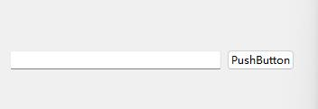
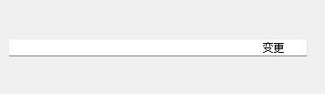

# 路径格式转换（斜杠与反斜杠转换）
使用
[QDir](Qt.md#QDir)静态函数
/转\\
使用QDir::toNativeSeparators

```c++
QString path = "C:/temp/test.txt";
auto convertpath = QDir::toNativeSeparators(path);
```
输出
```C:\\temp\\test.txt```

\转/
使用QDir::fromNativeSeparators
```c++
QString path = "C:\\temp\\test.txt";
convertpath = QDir::fromNativeSeparators(path);
```
输出
```C:/temp/test.txt```

# 软件路径截取软件名，文件类型，路径

有的情形下，需要用户选择对应文件，然后提取文件路径，或文件类型，或软件名字

```C++
QString fileName = QFileDialog::getOpenFileName(this,str,".",tr("*.exe"));
<<"E:/Code/QTool.exe"
```

获取软件名字：

```C++
auto appName = fileName.section(QRegExp("[/]"),-1);
<< "QTool.exe"
```

获取文件路径：

1. 

```c++
auto filePath = fileName.left(fileName.lastIndexOf("/"));
<< "E:/Code"
```

2. 

```cpp
QStringList list = fileName.split("/");
<< "E:"
   "Code"
   "QTool.exe"
// 然后就可以通过追加的方式拼接文件路径
QString file;
for(int i=0; i<list.size()-1; i++){
    file.append(list[i]);
    file.append("/");
}
<< "E:/Code/"
```

获取文件类型（后缀名）：

```c++
auto appSuffix = fileName.section(QRegExp("[/.]"),-1);
<< "exe"
```

最简单的办法，采用 [QFileInfo](Qt.md#QFileInfo) 类获取对应的信息

# 自定义 qDebug 输出打印信息
可以自定义 qDebug 打印信息的宏
```c++
#define cout qDebug()<<"["<<__FILE__<<__func__<<__LINE__<<"]"
```
输出将是
`[ ..\QChat\ChatWindow. cpp on_sendBtn_clicked 37 ] send button clicked!`

`__FILE__` ：当前源文件路径及文件名；  
`__LINE__` ：当前源代码行号；
`__func__` : 当前的函数名；（ `__FUNCTION__` 也可以实现）

## 输出彩色 log 信息
在要输出的文字前加上一段颜色指令。

指令格式如下`\033[*m `这里的`*`就是转义字符。

例如输出一段绿色的文字

```c++
qDebug() << "\033[32m" <<"Hello!";
```

即在输出文字前，先输出一个颜色指令。

**注意这个指令对后续的输出都会生效**

如果想关掉颜色只要再输出0号指令即可

```c++
qDebug() << "\033[0m";
```

指令表:

```text
　　0 : Reset Color Attributes
　　1 : 加粗
　　2 : 去粗
　　4 : 下划线
　　5 : 闪烁
　　7 : 反色
　　21/22 : 加粗 正常
　　24 : 去掉下划线
　　25 : 停止闪烁
　　27 : 反色
　　30 : 前景，黑色
　　31 : 前景，红色
　　32 : 前景，绿色
　　33 : 前景，黄色
　　34 : 前景，篮色
　　35 : 前景，紫色
　　36 : 前景，青色
　　37 : 前景，白色
　　40 : 背景，黑色
　　41 : 背景，红色
　　42 : 背景，绿色
　　43 : 背景，黄色
　　44 : 背景，篮色
　　45 : 背景，紫色
　　46 : 背景，青色
　　47 : 背景，白色
其它转义字符命令
    清除屏幕 : /033c
　　设定水平标位置 : /033[XG
　　X为水平标位置。
　　设定垂直标位置 : /033[Xd
　　Y为垂直标位置。
    /033[0K : 删除从标到该行结尾
　　/033[1K : 删除从该行开始到标处
　　/033[2K : 删除整行　
　　/033[0J : 删除标到萤幕结尾
　　/033[1J : 删除从萤幕开始到标处
　　/033[2J : 删除整个屏幕
```

例子：

```c++
qDebug() << "\033[31m" <<"Hello!";//输出红色
qDebug() << "\033[1m" <<"Hello!"<<"\033[0m";//加粗显示后重置
```

# QDesktopServices 打开文件管理器

许多桌面环境提供的服务可以被应用程序用来执行常见的任务，比如打开一个网页，这种方式既一致又考虑到用户的应用程序首选项。

此类包含为这些服务提供简单接口的函数，这些接口指示服务是成功还是失败。

OpenUrl ()函数用于打开位于外部应用程序中任意 URL 的文件。对于与本地文件系统上的资源相对应的 URL (其中 URL 模式为“ file”) ，将使用一个合适的应用程序来打开该文件; 否则，将使用 Web 浏览器来获取和显示该文件。

用户的桌面设置控制某些可执行文件类型是打开以供浏览，还是执行。一些桌面环境配置为防止用户执行从非本地 URL 获得的文件，或者在执行之前请求用户的权限。

用默认浏览器（例如：Chrome）打开一个网址：

```c++
QDesktopServices::openUrl(QUrl("http://blog.csdn.net/liang19890820"));
```

使用文件资源管理器打开一个文件夹：

```c++
QDesktopServices::openUrl(QUrl("file:///D:/Program Files/Youdao"));

QDesktopServices::openUrl(QUrl("file:///C:/Program Files", QUrl::TolerantMode));//QUrl::TolerantMode：QUrl 将尝试纠正 URL 中的一些常见错误。这种模式对于解析来自严格符合标准的来源的 URL 非常有用。

QDesktopServices::openUrl(QUrl::fromLocalFile("file:///C:/Program Files (x86)"));
```


> [QDesktopServices](https://doc.qt.io/qt-5/qdesktopservices.html)

# 设置QPushButton按钮加载中状态

按钮加载中状态。即QPushButton不仅要显示登录中的字样，还要显示一张加载中的GIF动图。

```c++
QMovie* movie = new QMovie("load.gif");
movie->start();
connect(movie, &QMovie::frameChanged, [=]{ 
    if (!btnLogin->isEnabled())
    {
        btnLogin->setText(" 登录中...");//空格增加与icon间隔
        btnLogin->setIcon(movie->currentPixmap());
    }
    else
    {
        btnLogin->setText("登录");
        btnLogin->setIcon(QIcon());
    }
});
```

效果如图：


通用场景：

```cpp
QMovie* movie = new QMovie(":/loading.gif");
movie->start();
connect(movie, &QMovie::frameChanged, this, [=]{
    ui->pushButton->setIcon(movie->currentPixmap());
});
connect(movie, &QMovie::stateChanged,[=]{
    if(movie->state() == QMovie::NotRunning)
    {
        ui->pushButton->setIcon(QIcon());
        qDebug()<<"movie not running";
    }
});

// other position
movie->stop();
```


# QPixmap 缩放属性
```cpp
QPixmap pixmap(path);
pixmap = pixmap.scaled(100, 100, Qt::KeepAspectRatio, Qt::SmoothTransformation);
```

# 获取系统标准路径

```cpp
QString standPath = QStandardPaths::writableLocation(QStandardPaths::AppDataLocation);
//C:/Users/<USER>/AppData/Roaming/<APPNAME>
```

> [QStandardPaths Class](https://doc.qt.io/qt-6/qstandardpaths.html)

# Html设置字体样式

```cpp
//14pt,红色字体
QString str{ R"(<p style="font-size: 14pt;color:red;">版本： </p>)" };
```
还可以实现版本+数字，版本黑体，数字蓝色
```html
<p style="font-size: 14pt; ">版本：<span style="color:#3377FF;">1.2.0</span></p>
```
效果：


`<font>`标签已弃用，不推荐使用。

# 递归遍历文件夹及文件
[文件目录操作](Qt.md#文件目录操作)

1. 深度遍历
```cpp
/**
 * \brief 递归遍历文件夹，找到所有的文件.
 * 
 * \param path 遍历的文件夹的路径
 * \return 
 */
int RecursiveFile(const QString& path)
{
    QDir dir(path);
    if (!dir.exists()) {
        return -1;
    }

    //过滤文件和文件名，去掉.和..的文件夹
    dir.setFilter(QDir::Dirs | QDir::Files | QDir::NoDotAndDotDot);

    //转化成一个list
    QFileInfoList list = dir.entryInfoList();
    if (list.size() < 1) {
        return -1;
    }

    for (auto it : list)
    {
        if (it.isDir())
        {
            RecursiveFile(it.filePath());
        }
        else
        {
            qDebug() << it.absoluteFilePath();
        }
    }
}
```

2. 广度遍历 - 队列
```cpp
void bfsFileTraverse(const QString& path)
{
    QFileInfo currentInfo(path);
    QDir dir(path);
 
    if(!dir.exists())
        return;
 
    QQueue<QFileInfo> infoQueue;    //队列
    infoQueue.enqueue(currentInfo);
 
    while(!infoQueue.isEmpty())
    {
        dir = infoQueue.head().filePath();    //取出队列第一个元素作为当前元素
        infoQueue.dequeue();
        dir.setFilter(QDir::Dirs | QDir::Files | QDir::NoDotAndDotDot | QDir::Hidden);    //过滤后只留下文件夹、文件以及隐藏文件，不包括当前文件夹和上级文件夹
        dir.setSorting(QDir::DirsFirst);    //优先排列文件夹
        QFileInfoList list = dir.entryInfoList();
        for(int i=0; i<list.size(); i++)
        {
            if(list.at(i).isFile())
            {
                //do what you wanna do
            }
            else
            {
                //do what you wanna do
                infoQueue.enqueue(list.at(i).filePath());
            }
        }
    }
}

```
3. 迭代器

```cpp
void FileTraverse(const QString& path)
{
    QDir dir(path);
    if(!dir.exists())
    {
        return;
    }
    QDirIterator dirIterator(path, QDir::Dirs | QDir::Files | 
    QDir::NoDotAndDotDot | QDir::Hidden, QDirIterator::Subdirectories);

    while(dirIterator.hasNext())
    {
        dirIterator.next();
        QFileInfo fileInfo = dirIterator.fileInfo();
 
        if(fileInfo.isFile())
        {
            qDebug()<<fileInfo.fileName();    //输出文件名
        }
    }
}
```

# QLineEdit 和 QPushButton 一体化
在输入框中增加按钮，而不是使用水平布局分割的形式
```cpp
auto layout = new QHBoxLayout();  
// 加入QLineEdit里后，光标需要变为默认，否则与LineEdit一致是输入光标  
ui->pushButton->setCursor(Qt::ArrowCursor);  
layout->addStretch();  
layout->addWidget(ui->pushButton);  
layout->setContentsMargins(0, 0, 0, 0);  
ui->lineEdit->setLayout(layout);
```
| 之前                      | 之后                     |
| ------------------------- | ------------------------ |
|  |  |

# 平台宏

特定操作系统的宏：

- Q_OS_WIN： Windows平台
- Q_OS_MAC： macOS平台
- Q_OS_LINUX：Linux平台
- Q_OS_ANDROID：Android平台
- Q_OS_IOS：iOS平台

特定编译器的宏：

- Q_CC_MSVC：Microsoft Visual C++编译器
- Q_CC_GNU：GNU编译器

特定架构的宏：

- Q_PROCESSOR_X86：x86架构
- Q_PROCESSOR_ARM：ARM架构
